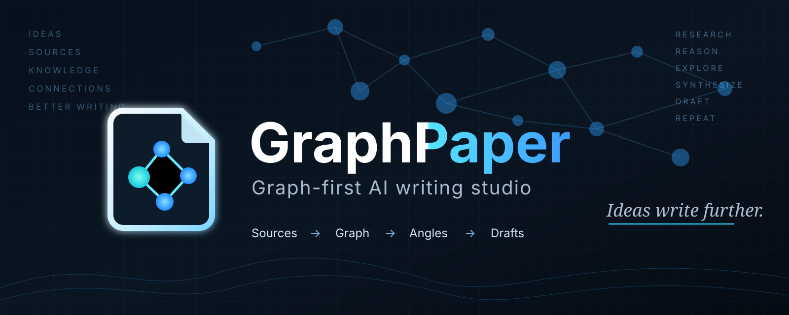
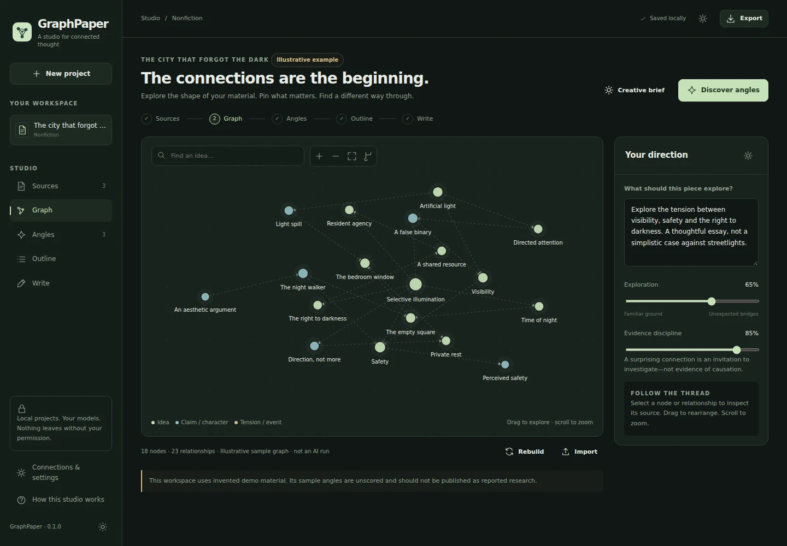
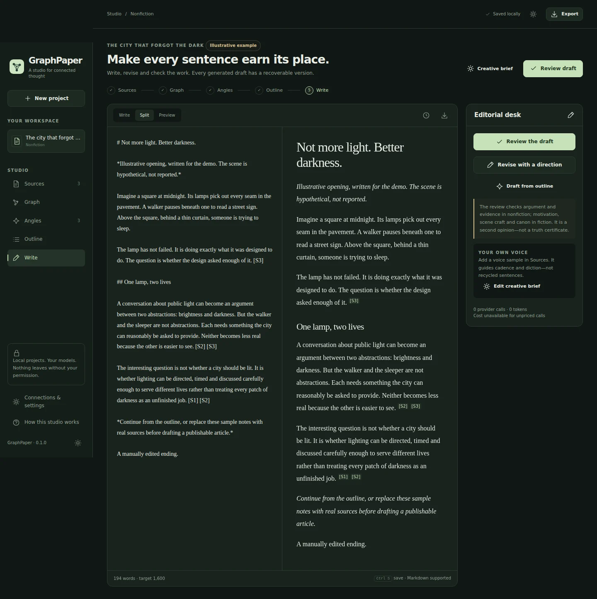

# GraphPaper


### A studio for connected thought.

**Windows fix: [v0.2.1](https://github.com/AronAxe/GraphPaper/releases/tag/v0.2.1)** fixes the native interface freeze and the save-on-close deadlock. Existing projects remain intact. See the [patch notes](docs/RELEASE-0.2.1.md).


**Source material → knowledge graph → a distinctive angle → an editable outline → writing worth reading.**

GraphPaper is a local-first, Windows-oriented writing studio for **nonfiction and fiction**. It is a graphical application, not a command-line writing tool. Bring your sources, see how their ideas connect, guide the interpretation, and keep authorship of the result.


*Actual app screenshot using the explicitly illustrative project included with the application.*

## GraphPaper 0.2.0

[**Download the Windows release**](https://github.com/AronAxe/GraphPaper/releases/latest) · [What is new](docs/UPDATE-0.2.md)

Your own writing voice from uploads or article URLs; a project Inbox with automatic local imports; reversible humanizer/deslopping passes; and **Codex / ChatGPT browser sign-in instead of a writing API key**. The Windows package includes Python and the official Codex runtime. Existing API providers and the optional JEV connection remain available.

## Open the source edition on Windows

1. Extract the complete source ZIP to a normal folder, not inside the ZIP viewer.
2. Double-click **`Open GraphPaper.vbs`**. This source edition needs **Python 3.11 or newer**, including Tcl/Tk. Python 3.12 or 3.13 is the conservative choice for the desktop dependencies.
3. In the setup window, choose **Install and open**. First setup downloads dependencies into a private virtual environment. Subsequent launches go straight to the studio.
4. Open **Connections & settings**, enter your provider key, choose a model and explicitly permit cloud processing. Start with either illustrated example to explore the interface without making model calls.

There is no need to type commands. The native window uses Microsoft Edge WebView2. See [Windows setup and troubleshooting](docs/WINDOWS.md).

**Executable packaging:** a Windows build script and GitHub Actions workflow are included. They generate a portable `GraphPaper.exe` folder/ZIP; this source package is not a prebuilt or signed Windows executable. Version 0.2 has native Windows automated tests and real-HTTP browser validation; see [validation scope](docs/QUALITY.md). Interactive native dialogs remain a separate check.

## A connected writing workflow

| Stage | What you control |
|---|---|
| **Sources** | Drag in PDF, DOCX, text, Markdown, CSV or HTML. Paste notes, import a public article URL, or import a saved project. Label material as evidence, fiction canon, inspiration or a voice sample. |
| **Graph** | Build an evidence-linked graph, or import Graphify/NetworkX JSON. Pan, zoom, drag nodes, inspect quote anchors, highlight a path, and pin or exclude concepts. |
| **Angles** | Discover distinct interpretations from contradictions, branches, convergences and cross-community connections. Edit the title/thesis, inspect the evidence gaps, or write your own angle. Nothing is selected for you. |
| **Outline** | Edit and reorder sections or scenes, change their purpose and beats, and allocate the word budget before drafting. |
| **Write** | Work in a quiet Markdown editor with live preview. Review evidence or scene craft, revise with a direction, inspect previous versions, and export Word, Markdown or print-friendly HTML. |



### Nonfiction is not fiction with citations bolted on

Nonfiction extraction distinguishes attributed claims, interpretations and source passages. Exact quotations are checked against the uploaded text. Drafts retain source references; the review checks citation integrity and samples substantive claims for source support. A missing or mismatched quote cannot be promoted to verified evidence.

**An exact quotation proves that the words occurred in a source, not that the source is correct or the conclusion follows.** The app keeps that distinction visible. It does not automatically browse the web to resolve every disputed fact.

### Fiction gets its own machinery

Start from a premise with no research corpus, or bring chapters and a story bible. Set genre, viewpoint, tense, voice and inviolable canon. The graph explores character conflicts and consequences. The writer works scene by scene and updates a compact continuity ledger of locations, knowledge, objects and unresolved threads. Reviews focus on motivation, causality, pacing, scene craft and canon—not invented academic citations.

The ledger is a generated summary of the drafting pass, not new author-approved canon. Recheck it after manual or whole-draft revisions.

### JEV is part of the control system

JEV/TypeSafe is used for **candidate screening, angle evaluation, evidence-gap signalling, next-action recommendations and a bounded revision acceptance gate**. It is not just a decorative score beside a headline.

The preferred connection is **OpenRouter**, with a **direct TypeSafe route** available. Auto uses an available OpenRouter key first, then direct TypeSafe. You can select a route explicitly or switch JEV off; the app labels unscored results honestly. Scores are model judgments, not empirically calibrated probabilities of truth or writing quality.

Writing providers: OpenRouter, OpenAI-compatible APIs including local endpoints, and direct Anthropic. Writer, extraction and editorial-review models can be set separately. No model name is hard-coded as a universal best choice.

### Graphify without making setup painful

The default native extraction backend works without installing Graphify and creates quote-linked graphs directly. You can also import a Graphify `graph.json` from the interface. An optional **real Graphify CLI bridge** is included for an existing Graphify installation; it augments native source checking rather than pretending imported relations are evidence.

Graphify is not bundled, and its subprocess integration has not been exercised against a live installation in this build environment. It has its own model spend, outside GraphPaper's request counter. See [integrations](docs/INTEGRATIONS.md).

## Local by default, explicit about costs

Projects and revisions live in a local SQLite database. Windows API keys use DPAPI rather than plaintext; session-only storage is available. Keys are not exposed to the browser or included in exports. Cloud generation requires explicit permission. A localhost model can operate without cloud permission.

Every GraphPaper AI job has a request budget, progress, cancellation, token receipts and recoverable checkpoints. Costs are shown only when the provider actually reports them. A request cap is not a monetary guarantee. Cancelling an in-flight request does not necessarily prevent its charge.

There are no analytics, remote fonts, hidden publishing or automatic agent loops. [Security details](docs/SECURITY.md).

## Included examples

**The city that forgot the dark** demonstrates nonfiction angle discovery with clearly fictional, illustrative source notes. **The last keeper of borrowed mornings** demonstrates literary speculative fiction with original canon and character relationships. They are interface examples, not benchmark results or verified reporting.

## Version 0.2 validation update

The 0.2 update was tested on a native Windows 11 machine with an isolated Python 3.13 environment: **120 automated tests passed**, with one symlink-permission test skipped; **all 26 real-HTTP browser workflow checks passed** with zero JavaScript page errors. The official bundled **Codex CLI 0.160.1** passed its signed-out app-server handshake and required-command checks. These are local Windows results, not GitHub-hosted CI results; the hosted runner remained queued and that run was cancelled. Reports are in [docs/validation/v0.2](docs/validation/v0.2/) (or the corresponding directory from this documentation page).

A real user OAuth completion, paid model calls, output-quality comparisons and hands-on native-window dialog interaction are not claimed as tested. Historical 0.1 results below remain a record of that earlier build.

## Development and validation

```bash
python -m pip install -r requirements-dev.txt
python -m pytest -q
python -m playwright install chromium
python scripts/ui_smoke.py
```

The desktop launcher remains the normal user experience. A developer-only browser fallback is available with `python -m graphpaper.desktop --browser`.

**Validated in the initial build environment:** 86 automated tests passed; 17 Chromium workflow checks passed; loopback HTTP/backend/static-asset self-test passed. One Windows DPAPI test was skipped on Linux. Model calls in the test suite use controlled mocks. Live provider output quality, live Graphify and native Windows/WebView2 execution still require testing in their actual environments. Repository Actions provide subsequent platform-specific validation results.

There is no claim that a graph automatically beats a strong direct prompt. GraphPaper makes a richer process possible; [the quality protocol](docs/QUALITY.md) describes how to compare it fairly.

## Publishing this source package

The optional **`Publish GraphPaper.vbs`** opens a separate graphical publisher for `AronAxe/GraphPaper`. It requires Git for Windows and your GitHub sign-in. It copies only a hash-checked source manifest into a fresh clone, pushes a **new branch**, and opens a pull-request comparison. It never force-pushes or overwrites `main`; publication needs an explicit click. The publisher itself was unit-tested for package validation, not exercised against a live GitHub account.

After merging, the repository's **Windows desktop package** workflow can build the portable executable. [Publishing instructions](docs/PUBLISHING.md).

## Documentation

[Windows](docs/WINDOWS.md) · [Architecture](docs/ARCHITECTURE.md) · [Integrations](docs/INTEGRATIONS.md) · [Quality](docs/QUALITY.md) · [Security](docs/SECURITY.md) · [Changelog](CHANGELOG.md)

**MIT License · Copyright © 2026 Aron Bijl.** Independent implementation; external systems retain their own licences and terms.
