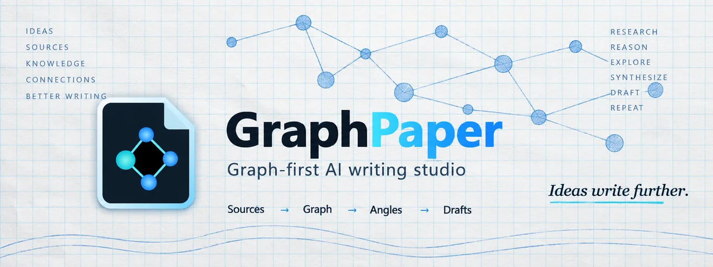
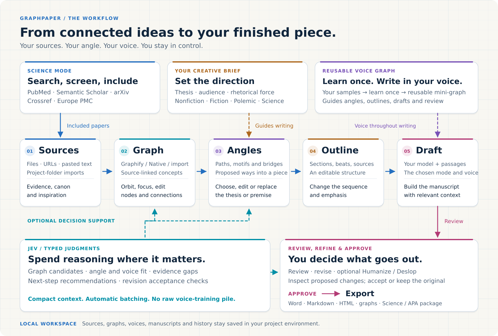
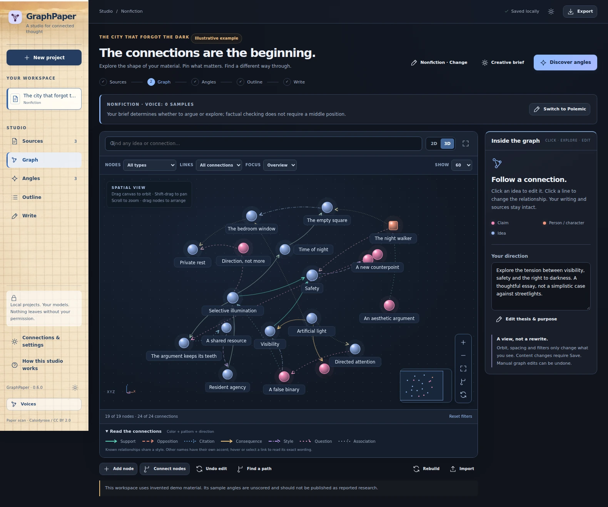
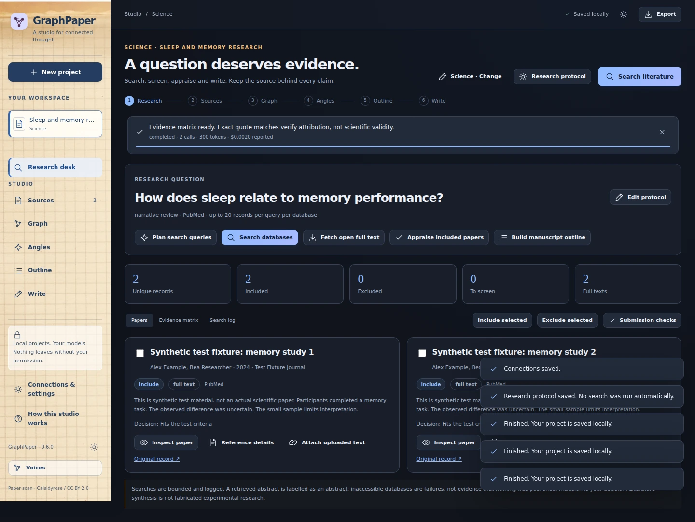
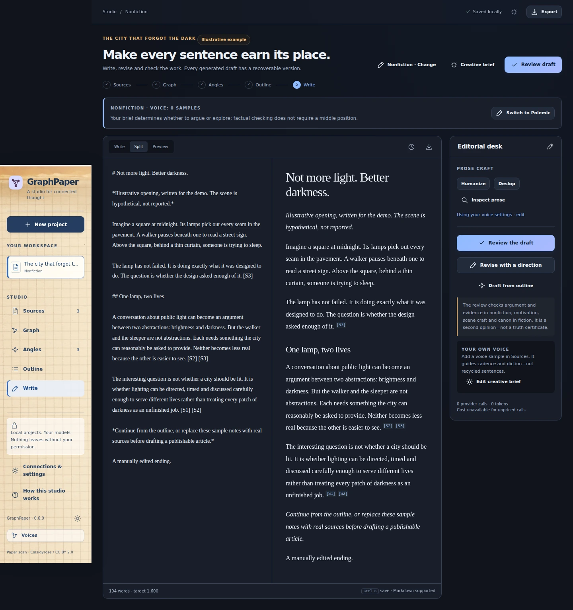

# GraphPaper

<strong>Connect your sources. Find your angle. Write in your own voice.</strong>

  
  
  
  
  
  

  <a href="https://github.com/AronAxe/GraphPaper/releases/latest"><strong>Download for Windows</strong></a> ·
  <a href="docs/GETTING-STARTED.md">Quick start</a> ·
  <a href="docs/README.md">Documentation</a> ·
  <a href="https://github.com/AronAxe/GraphPaper/wiki">Wiki</a> ·
  <a href="CHANGELOG.md">Changelog</a>

GraphPaper is a **local-first writing studio for nonfiction, fiction, polemic and scientific manuscripts**. Upload your material, explore its knowledge graph, choose a direction, shape the outline and refine the draft—all in a Windows desktop interface.

Use **Codex / ChatGPT sign-in** or your own model API. Keep control of the argument, the evidence and the final words. **Polemic and argument-led nonfiction preserve your thesis and voice across angle selection, outlining and review.** [Continue an existing project in Polemic](docs/POLEMIC.md).

**External Graphify now supports Codex sign-in and per-model reasoning.** The Windows release includes the public runtime; there is no extra API-key requirement or duplicate Native pass. [Graphify setup and distribution](docs/UPDATE-0.3.1.md)

**New in 0.6: the spatial graph studio.** Orbit or flatten your graph, focus its neighborhoods, and edit nodes and connections directly. Ink-blue surfaces and a real scanned graph-paper sidebar. [Explore the graph controls](docs/GRAPH-STUDIO.md).

## How GraphPaper works

Sources become a navigable graph, then an angle you choose, an outline you can edit and a draft you control. Your brief and saved voice guide the writing, while optional JEV helps evaluate candidates and editorial decisions.

## Four ways to write

| Mode | Start with | Build toward |
|---|---|---|
| **Nonfiction** | Articles, documents, notes and a question | A distinctive, source-linked essay or article |
| **Polemic** | A position, your reasoning and your own writing voice | An argument with conviction, wit and factual precision—not compulsory balance |
| **Fiction** | A premise, characters and the rules of your world | Scene-driven writing with a continuity ledger |
| **Science** | A research question and an explicit search protocol | An evidence-led manuscript, APA references and an auditable research package |

**Sources → Graph → Angles → Outline → Write**

Science adds a **Research** desk for scholarly search, screening and evidence appraisal. [Explore the workflows →](docs/README.md)

## Open the studio

1. Download the **Windows x64 ZIP** from [Releases](https://github.com/AronAxe/GraphPaper/releases/latest)—not GitHub’s “Source code” archive.
2. Extract the entire folder and open **`GraphPaper.exe`**. Keep `_internal` beside it. **No separate Python installation is needed.**
3. Open **Connections & settings**. Sign in with ChatGPT through Codex, or configure a supported API provider. Permit cloud processing before sending project material.
4. Create a project, add sources and begin. The included examples can be explored without model calls.

The portable build needs Microsoft Edge WebView2 and is currently unsigned. Existing projects live separately from the executable. [Windows setup and upgrades →](docs/WINDOWS.md)

**New: reusable voice graphs.** Save a voice once, select it in any project, and keep its training pieces separate. JEV receives compact graph context with automatic request sizing—not the article pile. [Voice graphs and author control](docs/VOICE-GRAPHS.md)

## What makes it useful

- **Explore before committing.** Orbit or flatten the graph, filter and focus its neighborhoods, and edit nodes and connections directly. Follow source links, pin ideas, undo graph edits and choose your own angle.
- **Keep your voice.** Save a reusable voice graph from your writing samples or selected articles, then apply it across projects without retraining. Edit its habits and influence; your current instructions remain in charge.
- **Improve prose without losing the original.** Humanize and Deslop offer separate or combined passes, protected factual spans, side-by-side proposals and explicit acceptance.
- **Work from a project folder.** Drop documents into a project’s Inbox. Role-specific subfolders distinguish evidence, canon, inspiration and voice samples; idle-time imports do not trigger paid model calls.
- **Choose where reasoning happens.** Configure writer, editor and extraction models separately, with provider-native reasoning controls. Optional JEV evaluates graph candidates, evidence gaps and revision decisions.
- **Do traceable literature work.** Search PubMed, Semantic Scholar, arXiv, Crossref and Europe PMC; screen papers, inspect accessible text and export the search log with the manuscript.

## Inside GraphPaper

*Actual v0.6 interface: the included illustrative project, spatial graph controls and colored connections. [Visual tour and capture provenance](docs/VISUAL-TOUR.md).*

<strong>Science, writing and reusable voice graphs — v0.6 screenshots</strong>

*Actual interface with clearly labelled synthetic workflow-test material.*

*The editable voice mini-graph, with a synthetic style example. Save once, reuse across projects.*

## Your models, your material

**Writing connections:** Codex / ChatGPT OAuth, OpenRouter, OpenAI-compatible APIs, local endpoints and direct Anthropic. Codex reasoning options follow its model catalog; there is no universal “ultra” setting. **JEV is a separate, optional OpenRouter/TypeSafe connection.** [Models and reasoning →](docs/CONNECTIONS.md)

Projects and revisions are stored locally. Cloud generation sends task-relevant material to the providers you authorize; local-first does **not** mean cloud models run offline. Windows API-key storage uses DPAPI. Codex maintains a separate account directory. [Privacy and security →](docs/SECURITY.md)

A graph suggests connections; it does not prove them. Science keeps capped searches, preprints and abstract-only evidence visible. APA export prepares a manuscript for author review—it does not confer journal acceptance or ethics approval. [Science workflow →](docs/SCIENCE.md)

## Documentation and development

[Getting started](docs/GETTING-STARTED.md) · [Project folders](docs/PROJECTS-AND-SOURCES.md) · [Author voice](docs/VOICE-AND-PROSE.md) · [Graph and JEV](docs/GRAPH-AND-JEV.md) · [Exports and APA](docs/EXPORTS-AND-APA.md) · [Troubleshooting](docs/TROUBLESHOOTING.md)

For implementation details, tests and builds, see the [developer guide](docs/DEVELOPMENT.md) and [architecture](docs/ARCHITECTURE.md). Recorded release validation is separate from the live CI badge: [test reports and scope](docs/QUALITY.md).

**[MIT licensed](LICENSE) · Created by Aron Bijl.** External runtimes and services retain their own licenses and terms.
