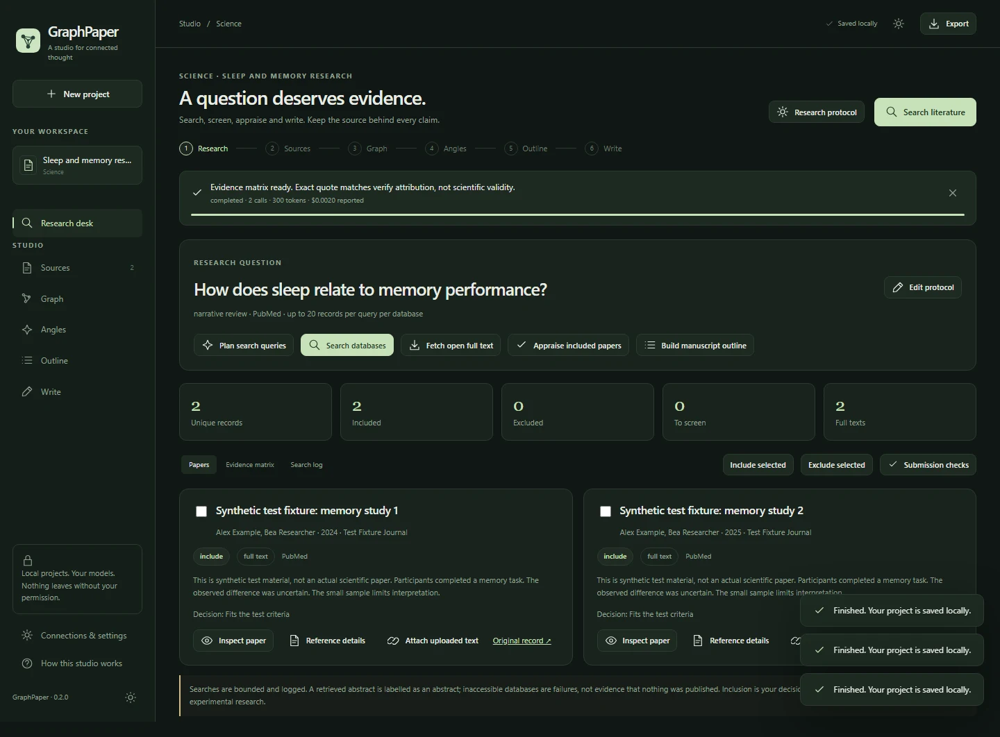

# Science: from literature search to manuscript

Science is a separate project mode for scholarly discovery, documented screening, evidence appraisal and academic writing. The default output is an **evidence-led narrative review**: real secondary research, not a fabricated new experiment.

*Actual interface with clearly labelled synthetic test material; this screenshot is not a scientific finding.*

## Define the protocol

Create a Science project and open **Research protocol**. Set a focused question, manuscript type, databases, date range, eligibility criteria and result limit. Optional population, intervention/exposure, comparator and outcome fields can make the question more precise.

Enter queries manually or use **Plan search queries**. The model proposes queries and criteria for you to review; planning does not claim that searches have been executed. Database-specific query overrides are available for syntax such as PubMed fields or arXiv’s `all:`, `ti:`, `abs:` and `cat:`.

Record preregistration only if it exists. The interface does not register a review or invent an identifier. A user-supplied field is an author statement, not an independently verified external record.

## Search the databases

**Search databases** sends actual metadata requests to your chosen services:

| Service | Role in GraphPaper |
|---|---|
| **PubMed** | Biomedical bibliographic records, structured author information and available abstracts |
| **Semantic Scholar** | Academic Graph records and available links; optional API key |
| **arXiv** | Preprints with explicit preprint labels |
| **Crossref** | DOI metadata discovery, scoped to journal articles |
| **Europe PMC** | Literature metadata, abstracts and available PMC full text |

A writing-model key is not needed for search. NCBI and Semantic Scholar keys are optional fields in Connections. Availability and rate limits belong to the services. If one fails, the app records the failure alongside successful searches; it does not describe the failure as an empty literature result.

Open **Search log** for the actual query, date, status, returned counts, duplicates and caps. Up to six general queries and 100 records per query per database can be requested, with a project ceiling of 600 unique research records. These are bounded searches, not an automatic promise of exhaustive retrieval.

Duplicate matching uses DOI and other identifiers, with cautious title/year matching when needed. Inspect ambiguous records and preserve provenance rather than treating deduplication as perfect entity resolution.

## Screen before synthesizing

Select relevant records and choose **Include selected** or **Exclude selected**. Exclusions require a reason, which is retained in the evidence record. Included papers become evidence sources associated with the project.

A paper can be metadata-only, abstract-only, available full text or author-supplied text. A metadata record does not justify an invented result. Retraction flags are surfaced and block ordinary inclusion as supporting evidence, but an absent flag is not proof that a paper has never been retracted.

Inspect author names, year, title, journal, DOI and source links through **Reference details**. Unstructured author names may need correction. This matters for APA citations as well as attribution.

## Obtain and inspect the text

**Fetch open full text** tries available accessible sources. Failures retain the previous content and display a reason. No paywall bypass or account-cookie scraping is performed.

To use a paper you obtained legitimately, upload it through Sources, then select **Attach uploaded text** on the matching record. Confirm that it is the exact paper and whether it is the complete readable text or only an excerpt. One source cannot casually be linked to different papers.

Read the imported text. Full-text availability does not imply successful interpretation of all figures or complex tables. An HTML landing page is not accepted merely because it was linked as a paper.

## Appraise the included evidence

**Appraise included papers** creates an evidence matrix describing reported design, sample, findings, limitations, opposing evidence and exact supporting quotations. Details not present in accessible text should remain “not reported” or not assessable.

A long source may be appraised from explicitly labelled beginning/middle/end excerpts. Inspect the coverage field. Exact quotation matching verifies where words came from, not the study’s validity or the model’s interpretation. Appraisals become stale when their source text changes.

Use the matrix to identify weak support, conflicting findings and missing full texts before drafting. It is not a validated risk-of-bias instrument or an automatically computed meta-analysis.

## Choose the manuscript type

| Type | Expected treatment |
|---|---|
| **Narrative review** | An evidence-led synthesis with a transparent description of the actual search and selection |
| **Scoping review** | A mapped evidence question with stricter completeness checks |
| **Systematic review** | Explicit eligibility, complete screening and disclosure/resolution of retrieval limits |
| **Protocol** | Proposed methods and planned analysis written as future work |
| **Empirical article** | Your own completed methods/results sources plus relevant literature |

Empirical mode requires you to identify your actual completed methods/results report. Literature references are not a new dataset. The application does not manufacture samples, p-values, effect sizes, pooled analyses, independent reviewers or ethics approval.

Systematic/scoping checks flag truncated searches, failed databases, unscreened records and missing criteria. A working export remains available, but a convenient manuscript is not evidence of a completed systematic-review method. Narrow or complete the real search appropriately and document what was actually done.

## Outline and draft

Create the scientific outline and edit the sections, beats and word allocation. Reviews use Introduction, Method, Results, Discussion and Conclusion; protocol structure emphasizes proposed methods and planned analysis. Graph exploration and angle selection can inform a hypothesis, but the evidence must be allowed to contradict it.

**Write manuscript** uses included evidence, the protocol and the actual search record. Internal `[S#]` citations preserve the link back to sources. An abstract and keywords are generated afterward and remain editable.

Review checks sample important claims and highlight citation or evidence problems. They do not certify every sentence. Verify any numeric claim, quotation, methodological detail and conclusion against the original material.

## Prepare for author review

Complete authors, affiliations, funding, conflicts, data availability, ethics and any AI-assistance disclosure. Open **Submission checks**. Resolve blockers and explicitly confirm source checking, journal/reporting requirements, authorship and method accuracy.

Confirmations apply to the current draft and research state; changes invalidate them. Journal acceptance and ethics approval are not outputs of this checklist. The target journal may require a specific reporting guideline, title-page format, tables, statistical files or a separate cover letter.

[APA and research-package exports →](EXPORTS-AND-APA.md)
