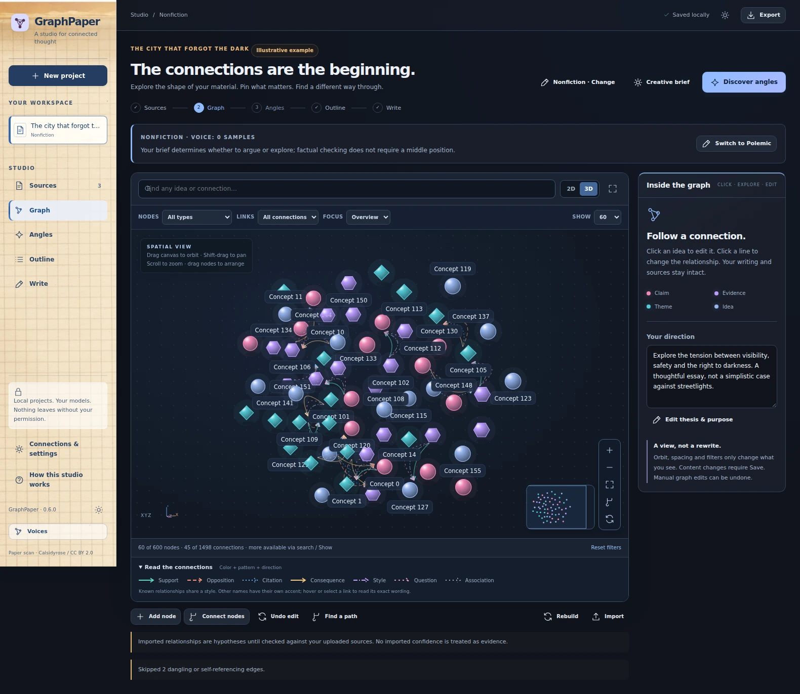
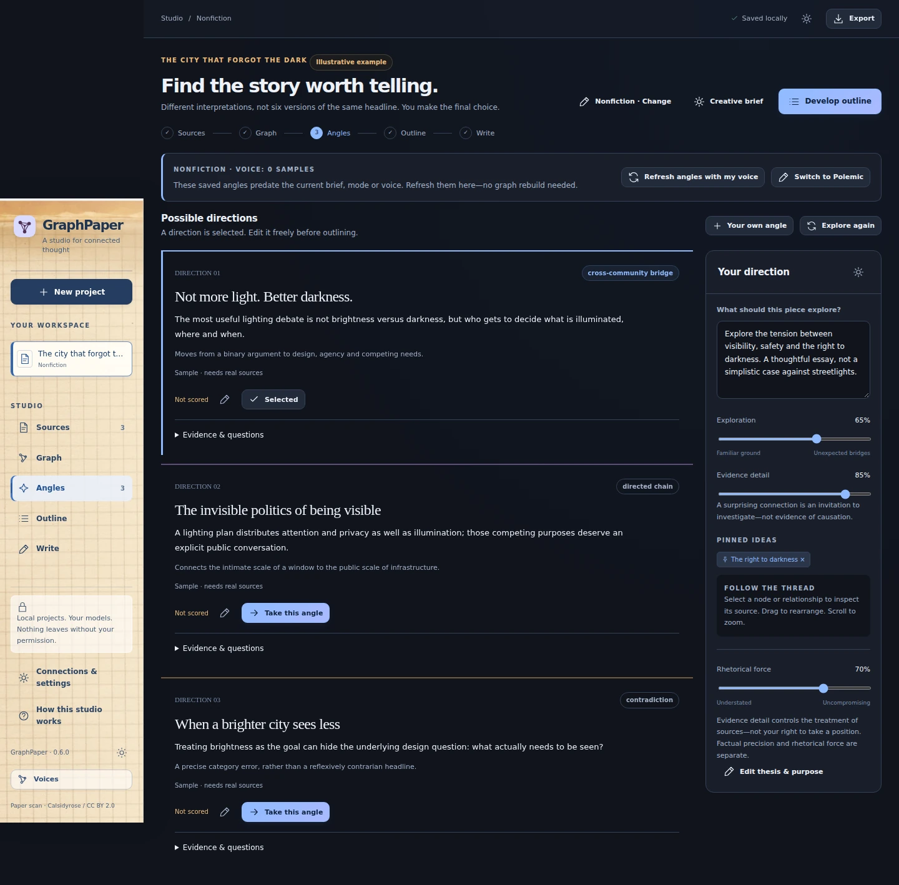
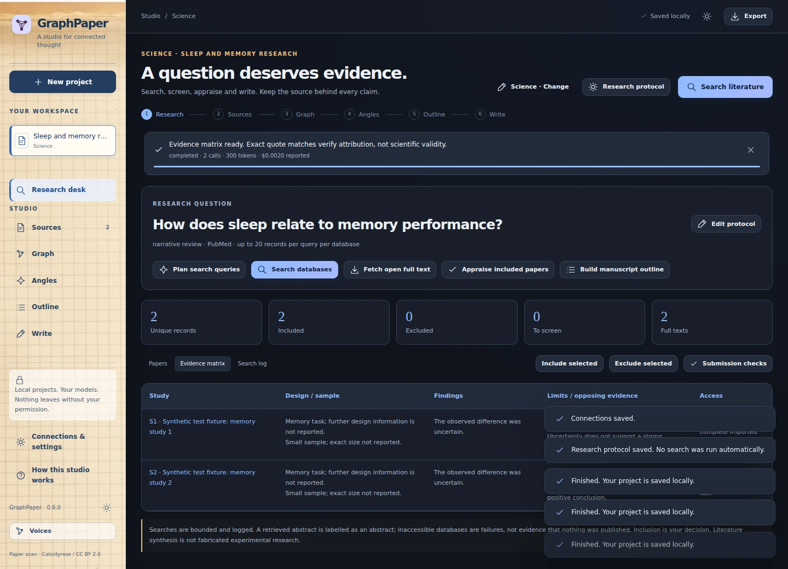
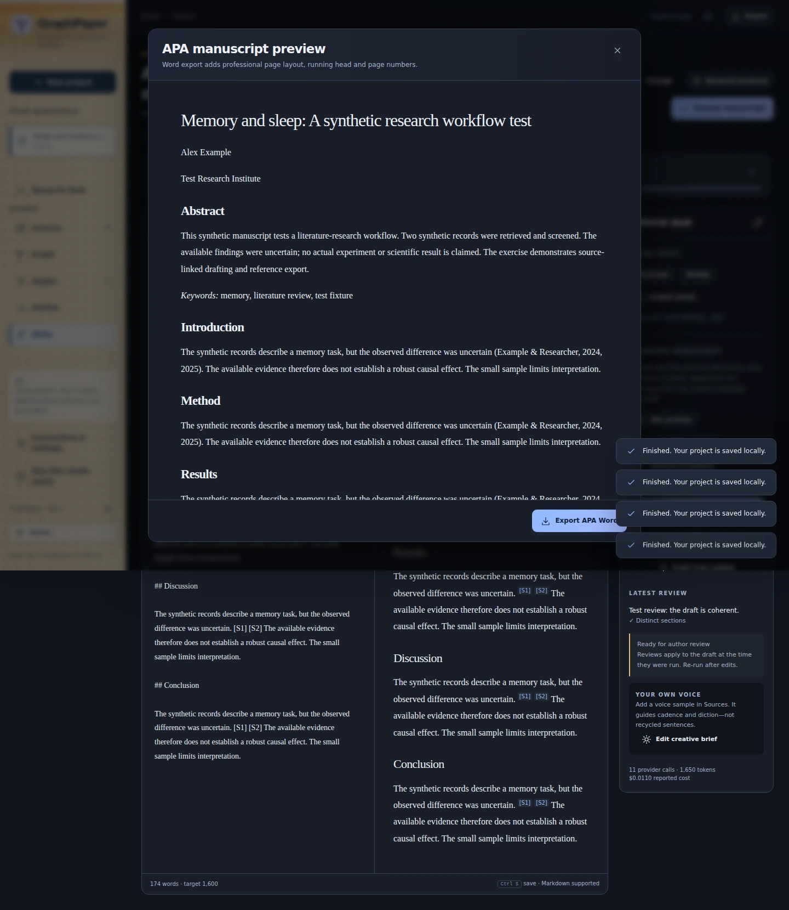
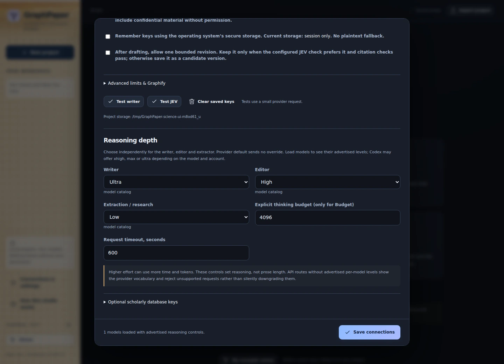
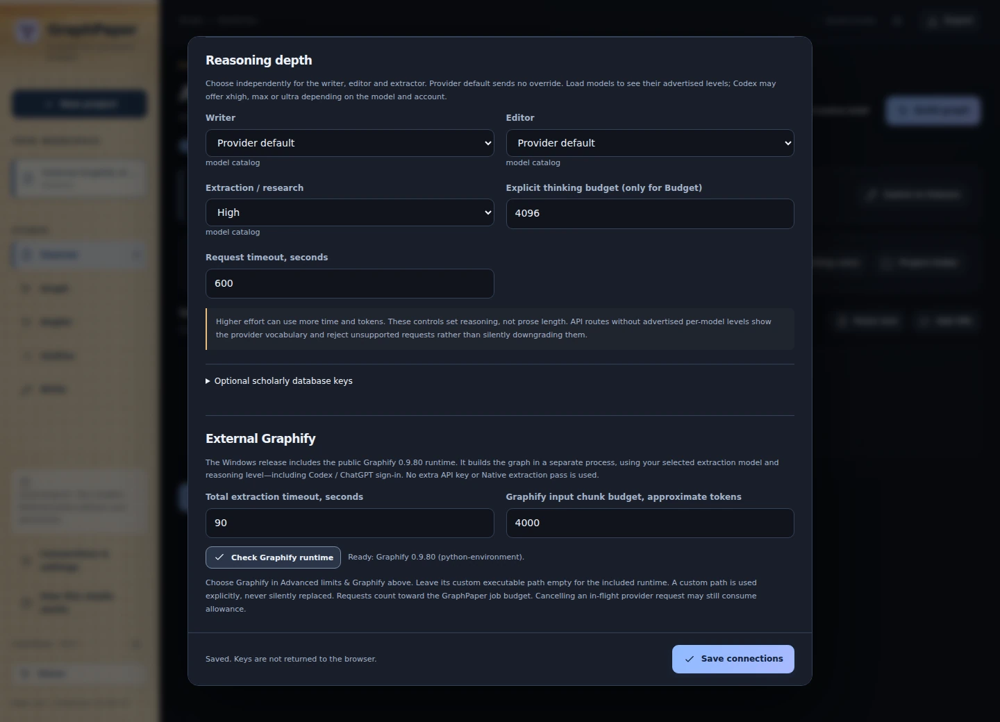
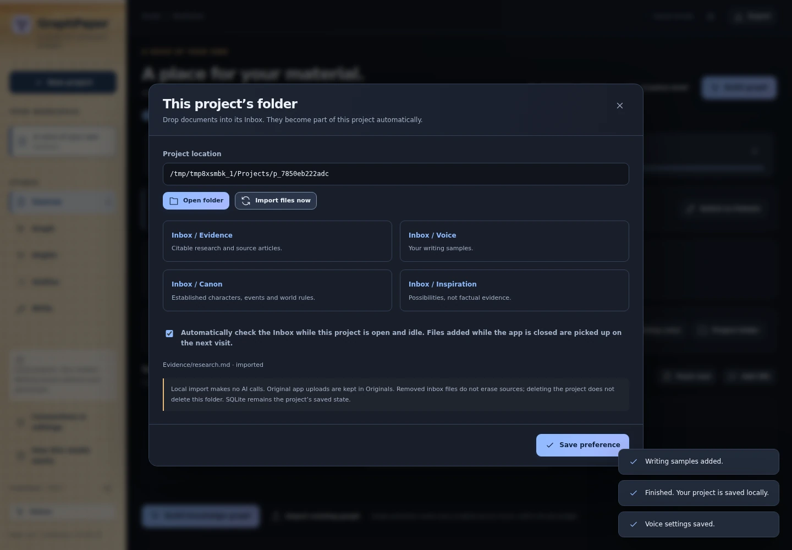
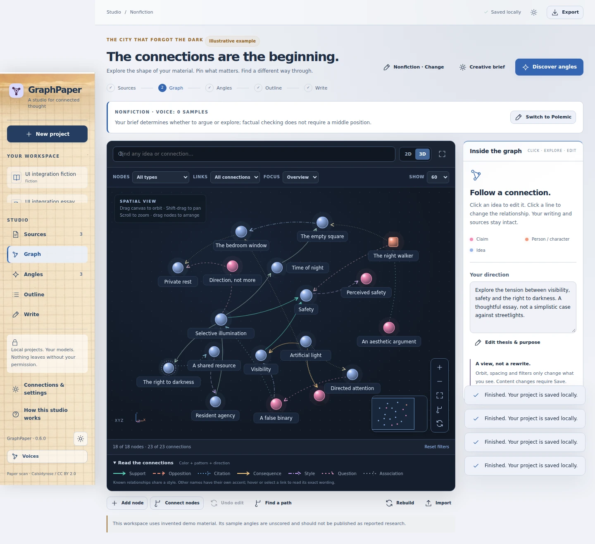

# Visual tour: GraphPaper 0.6.0

These are **screenshots of the actual running v0.6 interface**, not generated mockups. They were captured over loopback HTTP in Chromium during the successful [v0.6 release validation](https://github.com/AronAxe/GraphPaper/actions/runs/37807775156). The application UI is shared with the Windows desktop, but these images are browser captures, not screenshots of Windows window chrome.

The nonfiction project is an included illustrative example. Research records, provider responses and voice examples are synthetic test material, not published studies, private writing or measurements of model quality. Images were converted to WebP without retouching, compositing or changing interface content. [Capture provenance and checksums](images/screenshots-v0.6.json).

## Spatial graph studio

Orbit or flatten the view, focus neighborhoods, filter relationships, and edit nodes or connections in the inspector. [Graph studio guide](GRAPH-STUDIO.md).

## Dense graph overview

A synthetic 600-node graph exercises the default 60-node display budget. Full-graph search still reaches hidden nodes; view limits do not remove project data.

## Angles and the writing desk

Choose, edit or replace an angle. [Nonfiction](NONFICTION.md) · [Polemic](POLEMIC.md).

The illustrative manuscript, preview, editorial actions and saved versions belong to the same project. [Voice and prose tools](VOICE-AND-PROSE.md).

## Reusable voice graphs

Name a voice once and reuse its compact graph without copying training pieces into each article. This capture uses an explicitly entered synthetic style example. [Voice library guide](VOICE-GRAPHS.md).

## Science research desk

Search protocols, screening, references and retrieval status are visible together. The records in this image are labelled synthetic test fixtures. [Science workflow](SCIENCE.md).

Inspect evidence scope rather than assuming every retrieved record has full text.

Review author-year references and export readiness. [Exports and APA](EXPORTS-AND-APA.md).

## Connections, folders and prose proposals

<strong>Model reasoning and the bundled Graphify runtime</strong>

The captures use test model metadata. Available model IDs and reasoning levels depend on the selected provider. [Model setup](CONNECTIONS.md).

<strong>Project folder and reversible prose edits</strong>

[Project folders](PROJECTS-AND-SOURCES.md) · [Humanize and Deslop](VOICE-AND-PROSE.md).

## Light theme

The theme switch changes the workspace while retaining the paper sidebar. [Get started](GETTING-STARTED.md).
