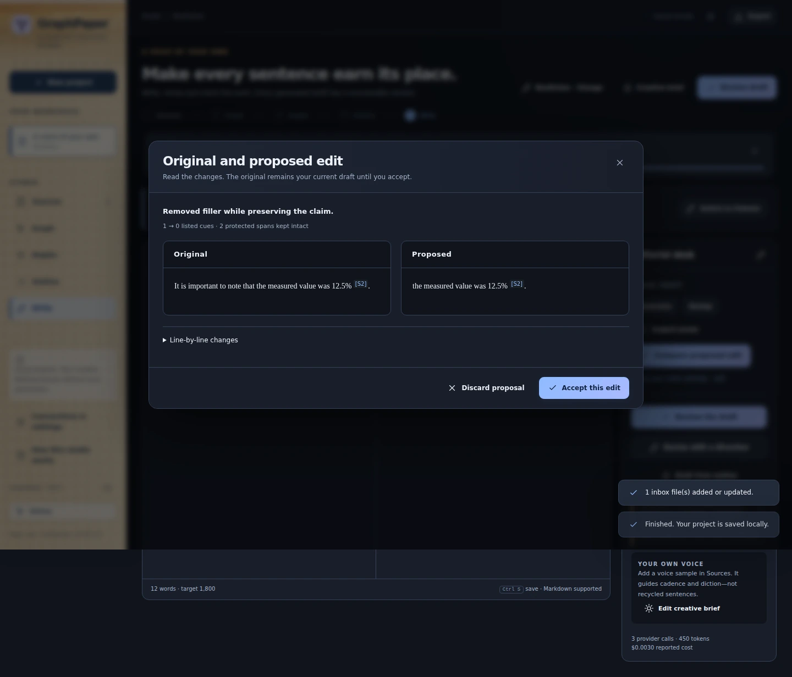

# Author voice, Humanize and Deslop

*Actual v0.6 original/proposed edit comparison with synthetic test prose. [Capture details](VISUAL-TOUR.md).*

GraphPaper can use your own writing as a style reference and offer reversible prose-editing passes. These features guide generation; they do not fine-tune model weights or promise perfect imitation.

## Save a voice once and reuse it

The **My voices** library stores named, editable voice graphs independently of article evidence. For an already learned profile, use **Your writing voice → Save as reusable voice**. In another project, select it and choose **Use in this project**. Saving an existing profile and applying it require no model call or copied training articles. Each project keeps an applied snapshot; later library changes take effect only when explicitly reapplied. [Complete library and overlay guide](VOICE-GRAPHS.md).

For a new reusable voice, choose **New voice**, add files, pasted text or article URLs under **Training pieces**, then **Learn / rebuild graph**. The source pieces are stored in the separate voice library.

## Add your writing

Open **Sources → Your writing voice**. Upload a document, paste a sample, or use **Find my writing online** with an article, author or blog URL.

The website tool lists up to 30 same-site candidate links and lets you choose up to 12 pieces to import. It does not assume every article on a website was written by you, and it does not silently crawl the entire site. Choose material you wrote or are authorized to use, and verify the imported text.

Voice sources guide cadence, diction and structure. They do not become factual evidence or scientific citations.

## Learn and edit the profile

**Learn my writing style** uses balanced excerpts and simple prose measurements to create a profile. Inspect its observations and edit the instructions into something you recognize. The influence slider controls how strongly the style should guide writing, and the on/off switch lets you compare results.

Useful instructions are specific: “Keep the short opening sentences and occasional dry aside; preserve technical qualifications.” Less useful instructions demand a vague personality while contradicting the examples.

If samples change, a learned profile can become stale. Refresh it; the old derived profile is not treated as a fresh analysis of the new material. Explicitly edited instructions are author direction. Projects retain their applied profile snapshot. A saved reusable graph also lives in the separate local voice library; neither is a fine-tuned model or a remote personalization service.

## Choose the right prose action

| Action | Purpose | Model call? |
|---|---|---|
| **Inspect prose** | Show explainable local cues such as filler and repeated constructions | No |
| **Humanize** | Improve cadence and expression, taking the author’s voice into account | Yes |
| **Deslop** | Remove formulaic padding, staged emphasis, vague attribution and unnecessary repetition | Yes |
| **Both** | Combine the two editing directions | Yes |

These are editorial tools, **not AI-authorship detectors or a promise to evade detection**. A scientific caveat, recurring phrase or dash can be intentional. The author’s samples and the piece’s genre matter more than a universal blacklist.

## Review the proposed edit

The pass stores a proposal separately from the manuscript. Open **Compare proposed edit** for a side-by-side view and line diff. Accept it deliberately or discard it.

Quotations, numeric material, citations, links, code and blockquotes receive protection checks. A proposal that drops or invents protected material fails validation. A separate editorial check looks for meaning drift, but it is still a model judgment: verify material claims yourself.

If you edit the manuscript after a proposal was created, that proposal is stale and cannot simply overwrite the new draft. Run a fresh pass against the current text. Accepted changes preserve the previous version for recovery.

## Make style serve the task

For nonfiction, look for unnecessary framing that delays the argument. For fiction, check whether an edit flattens subtext or removes a character’s distinctive speech. For Science, preserve methodological qualifications, reported uncertainty and terminology even when they sound less conversational.

A saved voice is not a politeness filter. Strong language, sarcasm, indignation and a decisive conclusion are valid author choices; explicit current instructions override saved defaults.

A lower cue count is not a quality score. The goal is a better passage with the same intended meaning—not the absence of every pattern on a list.

## Design references

The independent implementation was informed by the writing-focused approaches in [blader/humanizer](https://github.com/blader/humanizer) and [stephenturner/skill-deslop](https://github.com/stephenturner/skill-deslop). No full third-party prompt or code is presented as GraphPaper’s own. Historical research notes are preserved in [the 0.2 update](UPDATE-0.2.md); star counts are not treated as permanent quality rankings.

## Voice before the prose

Voice context and the authorial contract guide angle generation, outlining, the initial reviewer, drafting and prose edits. JEV receives the compact graph/profile view, not the raw voice-training articles. Rhetorical stance, humor and willingness to conclude are part of authorial style, not merely punctuation. Moral judgments are distinct from factual claims. See [Polemic and argumentative writing](POLEMIC.md).
