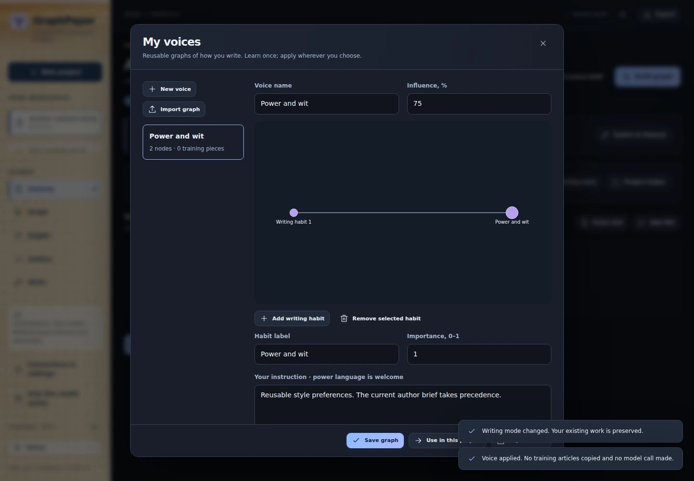

# Reusable voice graphs and compact JEV decisions

*Actual v0.6 voice library with a synthetic style example. [Capture details](VISUAL-TOUR.md).*

Create a voice once, name it, and apply it in any project. You do not need to upload or analyze the same writing repeatedly.

## Save the voice you already made

Open **Your writing voice**, then **Save as reusable voice**. The existing profile becomes a small node-and-edge graph without a new model call. Its training pieces are copied into the separate voice library; original project files are not deleted. Legacy voice samples are hidden from the evidence-card view, not mistaken for research.

In **My voices**, select the saved voice and choose **Use in this project**. Only the compact profile/graph is applied. No training articles are copied into the new project and no inference is run. Each project retains a snapshot, so changing or deleting the library entry does not silently alter other manuscripts. Apply the updated voice explicitly when desired.

## Build and edit a voice

Choose **New voice** in the library. Add writing by file upload, pasted text or an article URL under **Training pieces**. **Learn / rebuild graph** analyzes the samples once, with the configured extraction model. A learned graph captures rhythm, diction, structure, humor, rhetorical habits, imagery and force. Training text is stored separately in the local database and is sent for learning only; it is not put into ordinary JEV decisions.

You can instead enter style directions and convert them to nodes without a model call. Click a graph node to edit its instruction and importance. Add or remove habits, give the voice a name and save it. A saved voice can be exported/imported as a small JSON graph without the training articles or credentials.

**The voice graph is not a censor.** Strong language, profanity, ridicule, indignation and an uncompromising conclusion are valid author choices. A saved voice is a reusable default, not a rulebook: the current article brief and explicit instructions take precedence. Factual provenance and rhetorical strength are different things.

## Graph overlay

**View graph overlay** composes the saved style graph and a bounded view of the project graph. IDs are namespaced and the evidence, style and overlay layers stay distinguishable. Style edges describe how to express material, not whether an empirical claim is true. The stored evidence graph is not overwritten.

Graphify supports graph merging with namespaced IDs. This integration uses the compatible NetworkX node-link representation and graph composition already available in GraphPaper; it does not need another Graphify extraction or claim that lexical overlap proves semantic equivalence. A style directive can target a kind of project node, such as a claim, without becoming a source for that claim.

## Why JEV no longer receives the whole heap

JEV receives the compact style-graph view, the authorial contract and the material relevant to its typed questions. Raw training pieces are excluded. Candidate-specific decisions are automatically divided and combined according to the **serialized UTF-8 payload size**, with original question keys and candidate IDs retained. Questions can also be split independently. Repeated long strings can use lossless references instead of being duplicated.

The 60 KB cap is a GraphPaper transport budget, not a statement about a universal JEV model limit. The complete outgoing model/state/questions envelope is checked, including Unicode. Batches are planned before spending calls; receipts record their actual size and count. This does not raise the limit or quietly remove an author's thesis.

If a single decision genuinely cannot fit without discarding essential content, that optional decision stays **unscored**, with a job message. It does not abort the writing or pretend to approve an automatic revision. No missing result is converted into a made-up probability. API errors and invalid typed answers remain real errors, separate from local size planning.

## Storage and compatibility

The voice library is an additive table in the existing local SQLite database. Profiles, graph copies, legacy samples, project graphs and existing settings remain readable. Saved voices are not automatically synchronized to a remote service. Exporting a project includes its applied compact voice snapshot, not the whole global training library. Back up the closed application's local data directory for the complete library.

The update is implemented and built on GitHub-hosted runners. It does not access or modify the user's computer during development.

[Author voice and prose tools](VOICE-AND-PROSE.md) · [Polemic](POLEMIC.md) · [Graph and JEV](GRAPH-AND-JEV.md)
